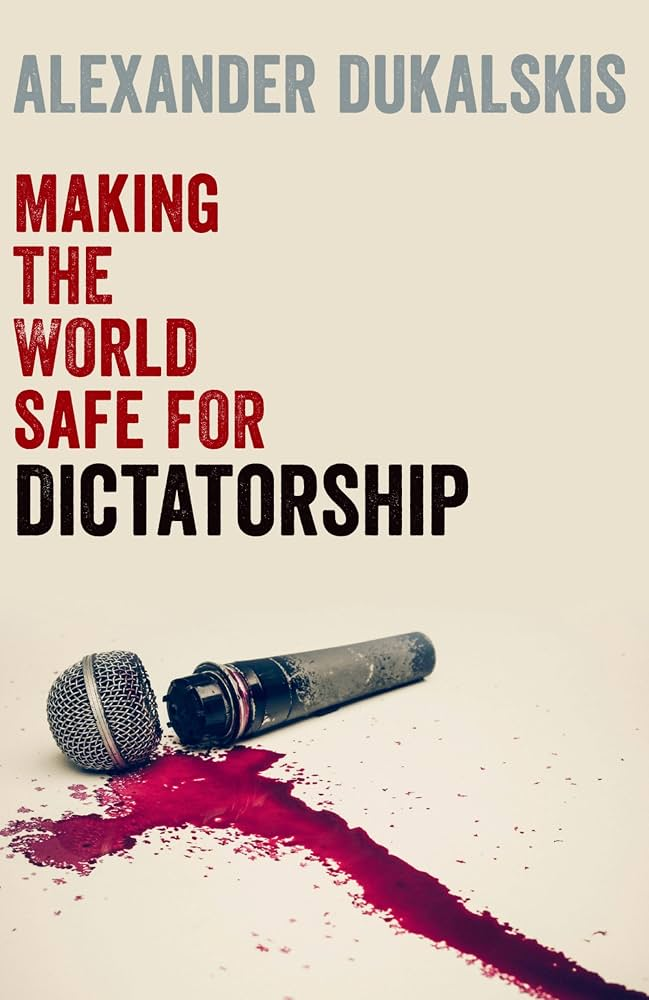
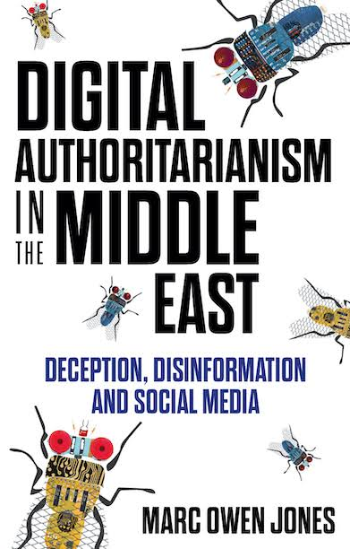
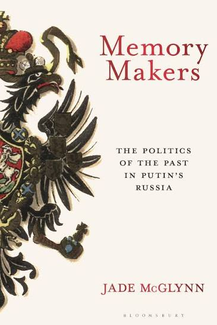
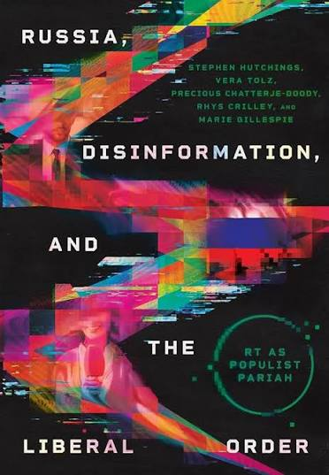
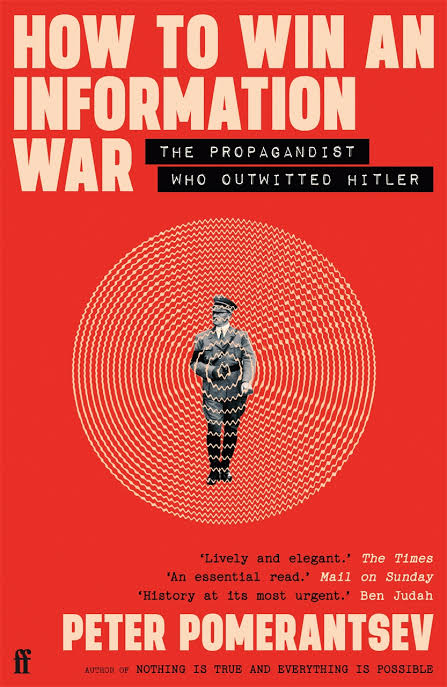

::: {.index-layout}

::: {.index-main}

## Course Overview

### How do governments persuade, distract, intimidate, and mobilise through communication?

This course examines propaganda, disinformation, and public diplomacy across an unusually wide range of political settings.

Rather than treating propaganda as an abstract or exclusively contemporary phenomenon, we study how it operates across different regimes, historical periods, media systems, and political cultures.

The course ranges from Franco’s Spain, Nazi Germany, and communist Czechoslovakia to Assad’s Syria and contemporary Russia, China, Turkey, Iran, Belarus, and the Gulf states. We also examine opposition and resistance in cases such as Chile and Ukraine, as well as democratic efforts to respond to foreign disinformation across Europe.

Across these cases, we ask how propaganda works, why citizens sometimes believe it and sometimes resist it, how regimes adapt communication to changing media environments, and how opposition actors, journalists, artists, and democratic institutions respond.

## Key Questions

- What distinguishes propaganda from persuasion, information, and disinformation?
- Why do authoritarian regimes invest in propaganda when they can also censor and repress?
- How do regimes construct narratives around economic performance, identity, history, and national greatness?
- Why do some citizens believe propaganda while others resist it?
- Can propaganda demobilise citizens even when they do not believe what they are told?
- How do opposition movements, journalists, humour, and popular culture challenge authoritarian communication?
- How do authoritarian states seek to influence foreign publics?
- How can democratic societies build resilience against foreign disinformation?

## Cases Across the Course

Russia 
State television, wartime propaganda, political identity, censorship, foreign influence, and opposition media.

China 
State media, censorship, social media propaganda, nationalism, indoctrination, and soft power.

Turkey 
Economic propaganda, historical narratives, media control, opposition communication, and public diplomacy.

Assad’s Syria 
Symbolic politics, authoritarian performance, political communication, and everyday practices of domination.

Spain under Franco 
Regime myth-making, political legitimacy, performance narratives, and representations of prosperity.

Nazi Germany 
Mass propaganda, radio, mobilisation, persuasion, and the problem of propaganda effectiveness.

Communist Czechoslovakia 
Propaganda, popular culture, conformity, and everyday life after the Prague Spring.

Chile under Pinochet 
Opposition campaigning, political communication, and democratic transition.

Rwanda 
Propaganda, mass communication, and political violence.

Ukraine 
Foreign disinformation, wartime communication, resistance, and societal resilience.

Belarus & Hungary 
Indoctrination, education, identity politics, and authoritarian governance.

Iran & the Gulf 
Digital authoritarianism, international communication, and regional influence.

## Course Journey

### I. Foundations

Authoritarianism · Disinformation · Media Systems · Propaganda

We begin by examining authoritarian rule, contemporary disinformation, media systems, and the conceptual and historical foundations of propaganda.

### II. Propaganda at Home

Performance · Economy · Identity · Indoctrination · Demobilisation

We then examine the narratives and communication strategies authoritarian governments use to sustain support, shape political identities, and discourage opposition.

### III. Resistance

Opposition · Humour · Journalism · Popular Culture

The course turns from authoritarian communication to the actors who challenge it, including opposition movements, independent journalists, satirists, and artists.

### IV. Propaganda Abroad

Public Diplomacy · Foreign Influence · Disinformation · Resilience

Finally, we examine how authoritarian states communicate beyond their borders and how democratic societies attempt to respond.

:::

::: {.course-books}

## Selected Books

:::

:::

## Explore the Course

The full syllabus is organised week by week, with required readings, further readings, and thematic reading lists.

[Explore the Weekly Readings →](readings.qmd)